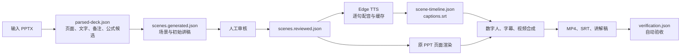

# 高等数学数字人讲演生成系统：阶段介绍与后续路线

更新时间：2026 年 7 月 29 日

## 一、项目目标

本项目的目标是把一份高等数学 PPTX 课件转换为可审核、可恢复、可重复生成的
数字人讲解视频，而不是只针对某一份课件写死场景和讲稿。

第一阶段确定的最小闭环是：

```text
文本型高数 PPTX
→ 解析页数、文字、备注和公式候选
→ 规划教学场景和讲稿
→ 人工检查并批准
→ Edge TTS 普通话配音
→ 原 PPT 画面、数字人和字幕合成
→ 输出并自动验收 MP4
```

目前这条技术闭环已经实际跑通。

## 二、系统当前处于什么阶段

系统已经从“几个互相独立、只能处理固定课件的脚本”，进入“能够更换文本型
PPTX 并生成视频的本地产品原型”阶段。

当前可以完成：

- 读取任意 `.pptx` 的真实页数；
- 提取每页标题、正文、备注和文本位置；
- 提取 PowerPoint 原生 OMML 公式及文本公式候选；
- 保留原 PPT 的公式、图形和排版作为视频主画面；
- 生成可人工编辑的结构化场景和讲稿 JSON；
- 使用 Edge TTS 生成普通话配音；
- 根据每句真实音频长度生成全局字幕时间轴；
- 合成 PPT 页面、卡通数字人、口型动画和硬字幕；
- 输出 1080P MP4、SRT 字幕和完整讲解稿；
- 自动检查页码、字幕重叠、音视频编码、时长和完整解码；
- 在任务失败后复用已经生成成功的语音缓存。

当前还不能称为“成熟产品”，主要原因是：

- 现有网页仍然使用 Mock API，尚未接入真实任务目录；
- 大模型规划代码已经完成，但尚未配置新的 API Key 做正式验收；
- 没有大模型时使用一页一个场景的规则讲稿，教学连贯性有限；
- 图片型公式、复杂动画和精确唇形仍未处理。

## 三、我完成了哪些工作

### 1. 重构 PPT 解析模块

原始粗糙版本存在硬编码公式、逐页独立调用模型、字幕时间重置和 API Key
写入源码等问题。现在已经改为：

- 使用 `python-pptx` 真实读取页面结构；
- 递归处理组合图形和表格；
- 提取演讲者备注；
- 保存每个文本块的位置和尺寸；
- 从 PPTX 压缩包中提取 OMML 数学节点；
- 对公式候选标记“需要人工核对”，不再伪造固定公式；
- 输出稳定的 `parsed-deck.json` 数据契约。

主要文件：

```text
backend/prepare.py
backend/contracts.py
```

### 2. 增加全局场景规划

系统不再假定“一页 PPT 必须对应一个视频场景”。大模型规划器允许：

- 一页拆成多个证明或推导场景；
- 合并内容较少的相邻页面；
- 区分开场、定义、定理、证明、推导、例题和总结；
- 分别生成字幕文字和适合 TTS 的口语文字；
- 为场景保留来源页码；
- 输出需要人工确认的问题。

存在 `DEEPSEEK_API_KEY` 或 `LLM_API_KEY` 时使用全局大模型规划；没有密钥
时使用保守的一页一场景规则，保证流水线仍然可以运行。

### 3. 建立人工审核关卡

解析后首先生成：

```text
scenes.generated.json
```

用户检查页码、数学结论、讲稿和公式读法后，执行批准命令生成：

```text
scenes.reviewed.json
```

视频渲染器默认拒绝未经批准的场景，避免错误数学讲稿直接进入最终视频。

主要文件：

```text
backend/approve.py
```

### 4. 接入 Edge TTS 和真实时间轴

完成了以下能力：

- 默认使用 `zh-CN-YunxiNeural`；
- 默认语速 `-8%`、音高 `-2Hz`；
- 逐句生成配音；
- 通过真实音频长度计算字幕起止时间；
- 输出一个全局 SRT，不再每页从零开始计时；
- 按文字、音色、语速和音高缓存配音；
- 网络中断后重新运行时只补失败句子；
- 过滤仅包含标点的无效 TTS 文本；
- 自动展开常见公式读法，例如极限、德尔塔埃克斯、绝对值和导数撇号。

主要文件：

```text
backend/video/synthesize.mjs
```

### 5. 整合原 PPT 画面与数字人视频

Windows 环境使用 PowerPoint COM 将每页原样导出为 1920×1080 PNG。
Docker/Linux 环境提供 LibreOffice 和 Poppler 回退方案。

视频画面采用：

- 左侧原 PPT 页面；
- 右侧场景标题、来源页码和进度；
- 右下角卡通教师；
- 张嘴和闭嘴两帧循环口型；
- 底部中文字幕；
- H.264 视频和 AAC 音频；
- `faststart` 便于网页播放。

主要文件：

```text
backend/video/render-frames.mjs
backend/video/create-video.mjs
backend/assets/avatar/
```

### 6. 增加自动验收

视频生成完成后会自动检查：

- 计划中的来源页码是否有效；
- 场景数与画面数是否一致；
- 字幕是否存在重叠或无效时间；
- SRT 数量是否与时间轴一致；
- 视频是否为 1920×1080；
- 是否包含 H.264 视频流和 AAC 音频流；
- 视频时长是否与时间轴一致；
- 整个 MP4 能否从头到尾完整解码。

检查结果写入：

```text
output/verification.json
```

只有 `status` 为 `passed` 才能视为技术验收成功。

主要文件：

```text
backend/video/verify.mjs
```

### 7. 增加状态记录和恢复能力

每个任务目录包含：

```text
job-status.json
```

其中记录：

- 当前状态；
- 当前处理阶段；
- 总体进度；
- 失败原因；
- 更新时间和完成时间。

任务失败后可以重新执行 `backend:render`。语音阶段会复用已经成功的缓存，
画面和视频阶段则根据现有任务数据重新生成。

### 8. 补齐环境与安全配置

已经完成：

- 安装并验证 `python-pptx`、OpenAI SDK 和 `pywin32`；
- 安装并验证 MiKTeX 26.5 中文公式编译环境；
- 安装 Edge TTS、Sharp、FFmpeg 和 FFprobe 依赖；
- 将 Sharp 升级到已修复当前 libvips 高危问题的版本；
- 增加 `backend/.env.example`，密钥不再写入代码；
- 将任务缓存、音频和视频产物加入 `.gitignore`；
- 增加 Dockerfile 和完整使用教程；
- 增加 Python 单元测试、TypeScript、ESLint 和 Next.js 构建检查。

旧粗糙工程中曾出现过硬编码 API Key。该旧密钥不应继续使用，应在对应平台
控制台撤销并创建新密钥。

## 四、系统数据流



## 五、已经完成的真实验收

使用 14 页《导数的概念（4）》高等数学课件进行了完整验收：

| 项目 | 结果 |
|---|---:|
| 原 PPT 页数 | 14 页 |
| 视频场景 | 14 个 |
| 字幕 | 65 条 |
| Edge TTS 音色 | `zh-CN-YunxiNeural` |
| 视频时长 | 216.78 秒，约 3 分 37 秒 |
| 分辨率 | 1920×1080 |
| 帧率 | 12 fps |
| 视频编码 | H.264 |
| 音频编码 | AAC，48kHz |
| 文件大小 | 约 6.36 MB |
| 页码覆盖 | 1–14 页全部覆盖 |
| 字幕重叠 | 无 |
| 完整解码 | 通过 |

成片、字幕和验收结果位于：

```text
backend/work/derivative/output/
```

该目录被 Git 忽略，不会把生成视频提交进代码仓库。

## 六、现在如何使用

### 第一步：解析并生成待审核讲稿

```powershell
npm.cmd run backend:prepare -- `
  --input "D:\课件\新的高等数学课件.pptx" `
  --job-dir "D:\jobs\calculus-001" `
  --audience "大学一年级" `
  --style "概念清楚、公式逐步推导"
```

### 第二步：人工编辑并批准

人工编辑：

```text
D:\jobs\calculus-001\scenes.generated.json
```

然后执行：

```powershell
npm.cmd run backend:approve -- `
  --job-dir "D:\jobs\calculus-001"
```

### 第三步：生成并验收成片

```powershell
npm.cmd run backend:render -- `
  --job-dir "D:\jobs\calculus-001" `
  --tts-mode edge
```

最终检查：

```text
D:\jobs\calculus-001\output\verification.json
```

## 七、接下来应该怎么做

后续工作应按下面的顺序推进。

### P0：先把“自动讲稿质量”做可靠

这是下一步最重要的工作，不要先购买 GPU，也不要先做图片公式 OCR。

需要完成：

1. 撤销旧硬编码密钥，创建新的大模型 API Key；
2. 通过环境变量配置新密钥，不写入源码；
3. 使用至少两份不同章节、每份 10 页以上的真实课件测试；
4. 检查模型能否正确拆分证明、例题和推导；
5. 检查公式的字幕形式和中文读法；
6. 检查模型返回错误 JSON、漏页或错误页码时能否安全回退；
7. 建立一份人工评分表，评价正确性、连贯性、公式读法和冗余程度。

验收标准：

- 所有场景都能追溯到来源页码；
- 不虚构定理条件和例题答案；
- 证明与计算步骤前后连贯；
- 常用公式能够被正常朗读；
- 人工修改量明显少于从零编写讲稿。

### P1：把真实流水线接入现有网页

当前 Next.js 前端还是 Mock API。下一步应增加真实 Route Handlers：

```text
POST /api/uploads
POST /api/projects/:id/prepare
GET  /api/jobs/:id
PUT  /api/scenes/:id
POST /api/projects/:id/approve
POST /api/projects/:id/render
GET  /api/projects/:id/result
```

前端需要能够：

- 上传真实 PPTX；
- 显示真实页面缩略图；
- 编辑每个场景的字幕和 TTS 口语；
- 标记数学问题和公式警告；
- 批准讲稿；
- 显示 `job-status.json` 的真实进度；
- 播放和下载最终 MP4/SRT。

验收标准：

- 用户不需要手动修改 JSON；
- 刷新网页后任务和修改不会丢失；
- 未批准讲稿不能开始生成；
- 生成失败后能够从网页重新启动并复用缓存。

### P2：拆分后台 Worker 和文件存储

不要让 Next.js Web 进程直接长期执行 FFmpeg。

推荐结构：

```text
浏览器 → Next.js Web/API → 任务队列 → 视频 Worker
                       ↘ 文件存储/OSS ↗
```

需要增加：

- 持久化数据库；
- 后台任务队列；
- 独立视频 Worker；
- 上传文件和成片存储；
- 超时、取消、重试和并发限制；
- 日志、磁盘空间和失败告警。

如果部署到阿里云，第一阶段仍建议使用 CPU 型 ECS，不需要 GPU。

### P3：最后再提升识别和数字人效果

在前面三步稳定后，再考虑：

- 图片公式 OCR；
- PPT 动画和逐步出现顺序；
- 公式 LaTeX 自动校对；
- 更自然的音素级唇形；
- 真人数字人或 MuseTalk/Wav2Lip；
- 本地大模型和本地 TTS；
- GPU 编码与多任务并发。

这些能力会显著增加成本和复杂度，不应阻塞当前 MVP。

## 八、建议的近期任务清单

最推荐的下一轮任务是：

1. 配置一个新的大模型 API Key；
2. 选择两份新的 10 页以上高数 PPTX；
3. 跑通自动全局场景规划；
4. 逐页人工检查并记录问题；
5. 调整提示词和 JSON 契约；
6. 确认讲稿质量后，再开发真实网页接口；
7. 最后把任务迁移到独立 Worker。

如果只选择一个下一步，应选择：

> 使用新大模型密钥和两份新课件，验证并改进自动场景规划与数学讲稿质量。

这是当前系统从“技术上能生成视频”走向“教学上能够使用”的关键。

## 九、相关文档

- `backend/README.md`：完整安装与运行命令；
- `docs/handoffs/PIPELINE_HANDOFF.md`：开发交接和当前状态；
- `backend/.env.example`：大模型与 Edge TTS 环境变量示例；
- `backend/Dockerfile`：容器化运行环境；
- `backend/work/derivative/output/verification.json`：14 页成片验收结果。
